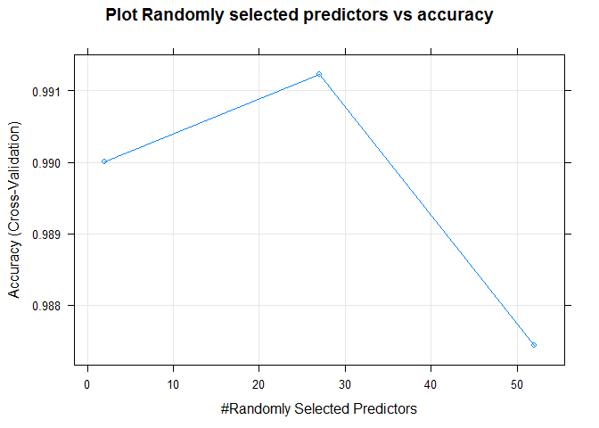

## Overview

Human activity recognition has emerged as a key research area in identifying human activities and in quantifying how well the activity is performed. It is now possible to collect large data sets of human activity measurements quite inexpensively. One such data set is the Weight Lifting Exercise data set.

The goal for this project is to train a model based on a training set with appropriate features and then predict the class of the weight lifting exercise (class A indicating correct executing and class B - E indicating improper execution).


## Exploratory Analysis 

Initial analysis of the data shows that there are 67 features in the training set that do not contain any value for more than 95% of the rows.

## Feature Selection for Model fitting
Let us identify variables with very little variability since these are not good predictors.


Results of the "nearZeroVar"" function indicate that there are 60 variables that are not good predictors. So, we will remove these from the training data set.


Continued analysis of the data shows that there are 41 features that are computed variables like standard deviation, variance, mean, min, max etc. These can be computed from the raw data and hence not useful for model training. So, we will remove them.

The resulting data has 59 features. Out of this, the first 6 features describe the row number, the identification of the person who did the exercise, the date/time stamps when the exercise was performed and the sliding window number form which the measurements were extracted. These do not have any bearing on the actual exercise and the measurements generated when performing the exercise. So, we will remove these features also before training the model.


## Cross validation Data Set
For the purposes of cross validating our model, we will randomly select 25% of the training data as a hold out set to perform cross validation. The seed has been set to 12321 to ensure reproducibility.


There are now 14718 rows to train the model and 4904 rows to perform cross validation.

## Model Fitting
Now, we will attempt to fit a "random forest"" model using the training set (after removing unwanted features and after removing the rows for the cross validation). We will use cross validation within the caret package with 5 folds for training the model.


```r
x <- training_final[,-53]
y <- training_final[,53]
fitControl <- trainControl(method = "cv",
                           number = 5,
                           allowParallel = TRUE)

fit <- train(x,y, method="rf",data=training_final,trControl = fitControl)
```


## Model Accuracy

The **model accuracy** based on the training data is as follows:

```
## Random Forest 
## 
## 14718 samples
##    52 predictor
##     5 classes: 'A', 'B', 'C', 'D', 'E' 
## 
## No pre-processing
## Resampling: Cross-Validated (5 fold) 
## Summary of sample sizes: 11774, 11775, 11774, 11774, 11775 
## Resampling results across tuning parameters:
## 
##   mtry  Accuracy   Kappa    
##    2    0.9900121  0.9873638
##   27    0.9912350  0.9889111
##   52    0.9874301  0.9840982
## 
## Accuracy was used to select the optimal model using the largest value.
## The final value used for the model was mtry = 27.
```

## Out of sample error

The confusion matrix when predicting against cross validation set is

```
## Confusion Matrix and Statistics
## 
##           Reference
## Prediction    A    B    C    D    E
##          A 1394    0    1    0    0
##          B   11  935    2    1    0
##          C    0    7  845    3    0
##          D    0    0    3  801    0
##          E    0    0    1    1  899
## 
## Overall Statistics
##                                           
##                Accuracy : 0.9939          
##                  95% CI : (0.9913, 0.9959)
##     No Information Rate : 0.2865          
##     P-Value [Acc > NIR] : < 2.2e-16       
##                                           
##                   Kappa : 0.9923          
##  Mcnemar's Test P-Value : NA              
## 
## Statistics by Class:
## 
##                      Class: A Class: B Class: C Class: D Class: E
## Sensitivity            0.9922   0.9926   0.9918   0.9938   1.0000
## Specificity            0.9997   0.9965   0.9975   0.9993   0.9995
## Pos Pred Value         0.9993   0.9852   0.9883   0.9963   0.9978
## Neg Pred Value         0.9969   0.9982   0.9983   0.9988   1.0000
## Prevalence             0.2865   0.1921   0.1737   0.1644   0.1833
## Detection Rate         0.2843   0.1907   0.1723   0.1633   0.1833
## Detection Prevalence   0.2845   0.1935   0.1743   0.1639   0.1837
## Balanced Accuracy      0.9959   0.9945   0.9947   0.9965   0.9998
```
The expected **Out of sample error rate** is 0.0061175  

## Predictions

The model is now ready to predict


```
##  [1] B A B A A E D B A A B C B A E E A B B B
## Levels: A B C D E
```


## Appendix

### Plots

The plot of randomly selected predictors vs accuracy (using cross validation) is provided below
<!-- -->

Importance of the various features in the model:
<!-- -->

